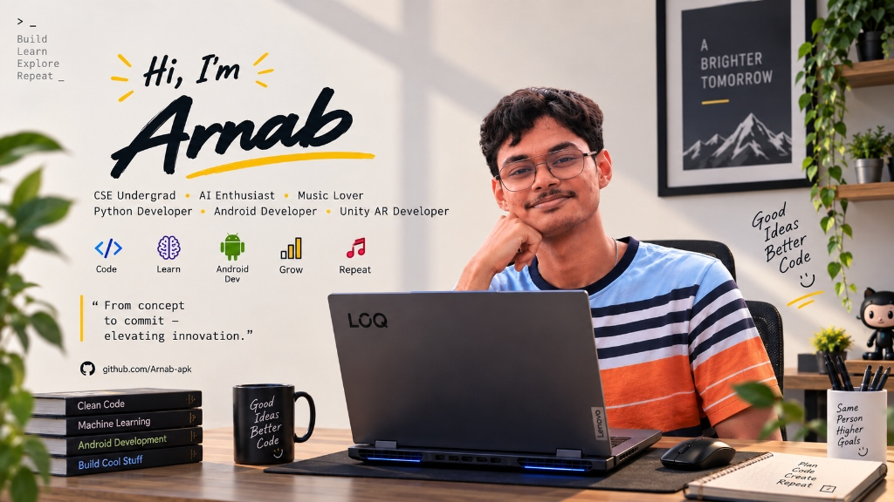

<!-- ============================================================
     ARNAB MANDAL — GitHub Profile README
     ============================================================ -->

<div align="center">



<br/><br/>

[](https://www.linkedin.com/in/arnab-mandal-00200131a/)
[](mailto:arnabmandal.dev@gmail.com)
[](https://github.com/Arnab-apk)
[](https://instagram.com/_mr.invictus__)

<br/><br/>

### 💡 *"From concept to commit — elevating innovation."* 🚀

[](https://github.com/Arnab-apk)

</div>

---


## 🧑‍💻 About Me

> *"Code. Break. Fix. Ship. Repeat."*

I'm a **Full Stack Developer**, **AI Engineer**, and relentless builder with a deep focus on **Generative AI**, **Agentic AI systems**, and **production-grade LLM applications**. I don't just learn technologies — I build real things with them, from RAG pipelines to autonomous agents, from console games to full-stack platforms.

Currently pursuing **B.Tech in Computer Science & Engineering** at Academy of Technology (AOT), Kolkata.

```python
class Arnab:
    name       = "Arnab Mandal"
    alias      = "Mr.Invictus"
    role       = ["AI Engineer", "Android & Full Stack Dev", "Unity AR Dev"]
    languages  = ["Python", "JavaScript", "TypeScript", "Kotlin", "Dart", "C++", "C", "SQL"]
    passion    = "Turning concepts into commits & elevating innovation"
    superpower = "Build → Learn → Explore → Repeat"
    philosophy = "Good Ideas, Better Code"
    fueled_by  = "Ideas & Coffee ☕"
    currently  = "Building Agentic AI workflows & RAG systems"
    fun_fact   = "I've forked more AI repos than most people have bookmarked"
```

<br clear="right"/>

---

## 🚀 Featured Projects

<details open>
<summary><b>🌺 Uma (Pujo Parikrama) — Real-Time Durga Puja Navigation & Live Group Hopping</b></summary>
<br/>

> **Flutter · Dart · Magic Lane Maps · OpenStreetMap · Firebase · Real-Time Group Sync**

A flagship high-performance Android mobile application built for navigating Kolkata's monumental Durga Puja festival. Curates 330+ verified pandals with offline vector tile caching, turn-by-turn routing, voice navigation, and live crowd telemetry. Features real-time companion tracking with separation perimeter alerts, walkie-talkie audio, dynamic festival day-aware theme morphing, and resilient offline Google & Guest session management.

**Tech:** Flutter 3 · Dart · Magic Lane GemKit SDK · OpenStreetMap · Firebase Auth & Firestore · WebSockets · SQLite / Vector Tile Caching · Geolocator · Provider


</details>

---

<details open>
<summary><b>🎵 Roomi — Real-Time Shared Music Platform</b></summary>
<br/>

> **Next.js · React · Socket.io · Spotify API · YouTube Music**

A real-time shared music platform that democratizes the aux at parties and group hangouts. Create rooms, share 6-character codes, and let everyone collaboratively build a queue with **democratic voting** to decide what plays next. Guests join instantly — no account needed. Features animated vinyl themes, glassmorphic UI, and seamless Spotify/YouTube Music integration.

**Tech:** Next.js 16 · React 19 · TypeScript · Express · Socket.io · Spotify OAuth · Tailwind CSS


</details>

---

<details open>
<summary><b>🧠 Model-StudyPlace — Interactive 3D Educational Platform</b></summary>
<br/>

> **Google Model Viewer · Vanilla JS · Tailwind CSS · Gemini AI**

A modern, interactive **3D learning hub** built with zero build steps — pure Vanilla JS, Tailwind CSS, and Google Model Viewer. Explore 3D models in the browser with full mobile responsiveness, and chat with an integrated **AI tutor powered by Google Gemini**. Deployed on Vercel with serverless API proxying for secure key management.

**Tech:** HTML · JavaScript · Tailwind CSS · Google Model Viewer · Gemini API · Vercel Serverless


</details>

---

<details open>
<summary><b>🐉 Chimera-CLI — AI-Powered Docker Config Generator</b></summary>
<br/>

> **Go · Cobra · Bubble Tea · Multi-LLM · Docker**

A developer CLI tool that **autonomously analyzes GitHub repos and generates production-ready Docker configurations**. Point it at any repo — it clones, detects frameworks (Express, Next.js, React, FastAPI, Flask, Django), validates findings via LLM, and spits out optimized multi-stage Dockerfiles + docker-compose configs. Supports OpenAI, Anthropic, Groq, Gemini, and Ollama as LLM providers.

**Tech:** Go · Cobra CLI · Bubble Tea TUI · Lipgloss · Docker · Multi-LLM


</details>

---

<details open>
<summary><b>👨‍💻 Code_CollabV2 — Real-Time Collaborative Code Editor</b></summary>
<br/>

> **React · Monaco Editor · Yjs CRDTs · FastAPI · WebSockets**

A browser-based collaborative coding platform where multiple developers **write, edit, and review code together in real time**. Powered by **Yjs CRDTs** for conflict-free concurrent editing with millisecond sync — no central authority needed. Features live remote cursors, Monaco Editor (VS Code engine), room management with approval workflows, real-time chat, and GitHub OAuth for repo imports.

**Tech:** React 19 · TypeScript · Monaco Editor · Yjs · FastAPI · WebSockets · Tailwind CSS


</details>

---

<details open>
<summary><b>🔐 hackstorm (CredVault) — Decentralized Identity MVP</b></summary>
<br/>

> **Next.js · Solidity · MongoDB · Merkle Proofs · Ed25519**

A decentralized identity system for issuing, storing, sharing, and verifying credentials on-chain. Uses **Merkle proofs** for credential integrity and anchors batch roots via Solidity smart contracts on Polygon Amoy. Features role-based dashboards (issuer/recipient/verifier), wallet-based auth, selective disclosure through shareable links, and five predefined credential schemas.

**Tech:** Next.js · React · TypeScript · MongoDB · Solidity · Hardhat · Ed25519 · Keccak Hashing


</details>

---

## 🛠️ Tech Stack

<div align="center">

### 🧠 AI & Machine Learning

<br/>
[](https://openai.com/)
[](https://langchain.com/)
[](https://langchain-ai.github.io/langgraph/)
[](https://llamaindex.ai/)
[](https://ollama.com/)
[](https://huggingface.co/)

<br/><br/>

### 🌐 Full Stack & Web

<br/>
[](https://streamlit.io/)
[](https://gradio.app/)

<br/><br/>

### 📱 Mobile, AR & Languages

<br/>
[](https://www.mysql.com/)

<br/><br/>

### 📡 Databases & Vector Storage

<br/>
[](https://pinecone.io/)
[](https://weaviate.io/)
[](https://github.com/facebookresearch/faiss)

<br/><br/>

### 🔧 Tools & DevOps

<br/>
[](https://learn.microsoft.com/en-us/windows/wsl/)

</div>

## 👻 Eating Up My Contributions

<div align="center">
	<picture>
		<source media="(prefers-color-scheme: dark)" srcset="https://raw.githubusercontent.com/Arnab-apk/Arnab-apk/output/pacman-contribution-graph-dark.svg">
		<source media="(prefers-color-scheme: light)" srcset="https://raw.githubusercontent.com/Arnab-apk/Arnab-apk/output/pacman-contribution-graph.svg">
		
	</picture>
</div>


<div align="center">

| Phase | Goal | Status |
|:---:|:---|:---:|
| 🤖 | Master **LangGraph** & advanced agentic workflows | `IN PROGRESS` |
| 🔬 | Ship **10+ AI-powered** production applications | `IN PROGRESS` |
| 🌐 | Full Stack + **GenAI convergence** at scale | `IN PROGRESS` |
| 📡 | Production-grade **RAG pipelines** with vector DBs | `IN PROGRESS` |
| 💪 | Strengthen **DSA** with C++ & competitive coding | `GRINDING` |
| 🚀 | Contribute to **major open-source** AI projects | `EXPLORING` |
| ☁️ | **Kubernetes** & cloud-native AI deployment | `NEXT UP` |
| 🏗️ | Build & deploy a **production AI SaaS** app | `PLANNED` |

</div>

---

## 🧭 Competitive Coding

<div align="center">

[](https://leetcode.com/u/6IDfCDzl1s/)
[](https://www.hackerrank.com/profile/arnabmandal261)

</div>

---

<div align="center">

### 🌐 Connect With Me

[](https://www.linkedin.com/in/arnab-mandal-00200131a/)
[](mailto:arnabmandal.dev@gmail.com)
[](https://github.com/Arnab-apk)
[](https://instagram.com/_mr.invictus__)

<br/>


> *"The best way to learn is to ship."*
> **— Arnab Mandal**

</div>
