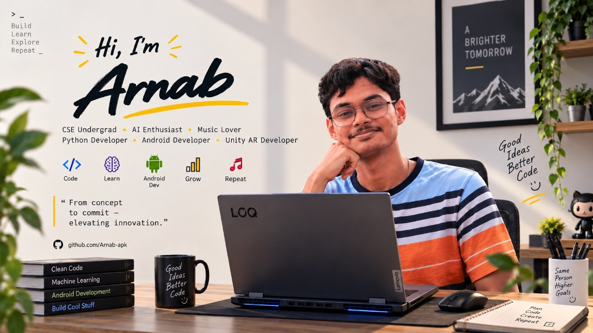

<div align="center">



<br/>

# Arnab Mandal
### AI Engineer · Full Stack Developer · Builder of Agentic Systems

[](https://www.linkedin.com/in/arnab-mandal-00200131a/)
[](mailto:arnabmandal261@gmail.com)
[](https://github.com/Arnab-apk)
[](https://instagram.com/_mr.invictus__)

*"From concept to commit — elevating innovation."*

[](https://github.com/Arnab-apk)

<br/><br/>

<table>
<tr>
<td valign="top"></td>
<td valign="top"></td>
</tr>
</table>

</div>

---

## About Me

I'm a **Full Stack Developer** and **AI Engineer** focused on **Generative AI**, **agentic systems**, and production-grade LLM applications — currently pursuing a **B.Tech in Computer Science & Engineering** at the Academy of Technology (AOT), Kolkata.

I build end to end: RAG pipelines, autonomous multi-agent workflows, and full-stack products, not just prototypes.

```python
class Arnab:
    name       = "Arnab Mandal"
    alias      = "Mr. Invictus"
    role       = ["AI Engineer", "Full Stack Developer", "Android & Unity AR Dev"]
    languages  = ["Python", "JavaScript", "TypeScript", "Kotlin", "Dart", "C++", "C", "SQL"]
    currently  = "Building agentic AI workflows & RAG systems"
    philosophy = "Good ideas, better code"
```

---

## Featured Projects

<details open>
<summary><b>🌺 Uma (Pujo Parikrama) — Real-Time Durga Puja Navigation & Live Group Hopping</b></summary>
<br/>

A high-performance Android app for navigating Kolkata's Durga Puja festival. Curates 330+ verified pandals with offline vector-tile caching, turn-by-turn voice navigation, and live crowd telemetry. Includes real-time companion tracking with separation-perimeter alerts, walkie-talkie audio, festival-day-aware theming, and resilient offline Google/Guest session handling.

**Tech:** Flutter 3 · Dart · Magic Lane GemKit SDK · OpenStreetMap · Firebase Auth & Firestore · WebSockets · SQLite / Vector Tile Caching · Geolocator · Provider


</details>

<details>
<summary><b>🎵 Roomi — Real-Time Shared Music Platform</b></summary>
<br/>

A real-time shared listening room for parties and group hangouts. Create a room, share a 6-character code, and build a shared queue through democratic voting — guests join instantly with no account needed. Features animated vinyl themes, a glassmorphic UI, and Spotify / YouTube Music integration.

**Tech:** Next.js 16 · React 19 · TypeScript · Express · Socket.io · Spotify OAuth · Tailwind CSS


</details>

<details>
<summary><b>🧠 Model-StudyPlace — Interactive 3D Educational Platform</b></summary>
<br/>

A zero-build-step 3D learning hub built with vanilla JS, Tailwind CSS, and Google Model Viewer. Explore 3D models directly in the browser with full mobile responsiveness, plus an integrated AI tutor powered by Google Gemini. Deployed on Vercel with serverless API proxying for secure key management.

**Tech:** HTML · JavaScript · Tailwind CSS · Google Model Viewer · Gemini API · Vercel Serverless

**Repo:** [github.com/Arnab-apk/Model-StudyPlace](https://github.com/Arnab-apk/Model-StudyPlace)


</details>

<details>
<summary><b>🐉 Chimera-CLI — AI-Powered Docker Config Generator</b></summary>
<br/>

A CLI tool that analyzes a GitHub repo and generates production-ready Docker configs. Point it at any repo — it clones, detects the framework (Express, Next.js, React, FastAPI, Flask, Django), validates its findings via an LLM, and outputs optimized multi-stage Dockerfiles and docker-compose configs. Supports OpenAI, Anthropic, Groq, Gemini, and Ollama as providers.

**Tech:** Go · Cobra CLI · Bubble Tea TUI · Lipgloss · Docker · Multi-LLM


</details>

<details>
<summary><b>👨‍💻 Code_CollabV2 — Real-Time Collaborative Code Editor</b></summary>
<br/>

A browser-based collaborative coding platform for writing, editing, and reviewing code together in real time. Powered by Yjs CRDTs for conflict-free concurrent editing with millisecond sync and no central authority. Features live remote cursors, Monaco Editor (the VS Code engine), room management with approval workflows, live chat, and GitHub OAuth for repo imports.

**Tech:** React 19 · TypeScript · Monaco Editor · Yjs · FastAPI · WebSockets · Tailwind CSS


</details>

<details>
<summary><b>🔐 hackstorm (CredVault) — Decentralized Identity MVP</b></summary>
<br/>

A decentralized identity system for issuing, storing, sharing, and verifying credentials on-chain. Uses Merkle proofs for credential integrity and anchors batch roots via a Solidity smart contract on Polygon Amoy. Features role-based dashboards (issuer / recipient / verifier), wallet-based auth, selective disclosure through shareable links, and five predefined credential schemas.

**Tech:** Next.js · React · TypeScript · MongoDB · Solidity · Hardhat · Ed25519 · Keccak Hashing


</details>

---

## Tech Stack

<div align="center">

**AI & Machine Learning**
<br/>
<br/>


<br/>

**Full Stack & Web**
<br/>
<br/>


<br/>

**Mobile, AR & Languages**
<br/>
<br/>


<br/>

**Databases & Vector Storage**
<br/>
<br/>


<br/>

**Tools & DevOps**
<br/>


</div>

---

## GitHub Activity

<div align="center">
  <picture>
    <source media="(prefers-color-scheme: dark)" srcset="https://raw.githubusercontent.com/Arnab-apk/Arnab-apk/output/pacman-contribution-graph-dark.svg">
    <source media="(prefers-color-scheme: light)" srcset="https://raw.githubusercontent.com/Arnab-apk/Arnab-apk/output/pacman-contribution-graph.svg">
    
  </picture>
</div>

---

## Current Focus

| Area | Goal | Status |
|:---:|:---|:---:|
| 🤖 | Master **LangGraph** and advanced agentic workflows | `In Progress` |
| 🔬 | Ship **10+ AI-powered** production applications | `In Progress` |
| 🌐 | Full-stack + **GenAI convergence** at scale | `In Progress` |
| 📡 | Production-grade **RAG pipelines** with vector DBs | `In Progress` |
| 💪 | Strengthen **DSA** with C++ and competitive coding | `Ongoing` |
| 🚀 | Contribute to **major open-source** AI projects | `Exploring` |
| ☁️ | **Kubernetes** and cloud-native AI deployment | `Next Up` |
| 🏗️ | Build and deploy a **production AI SaaS** app | `Planned` |

---

## Competitive Coding

<div align="center">

[](https://leetcode.com/u/6IDfCDzl1s/)
[](https://www.hackerrank.com/profile/arnabmandal261)

</div>

---

<div align="center">

### Let's Connect

[](https://www.linkedin.com/in/arnab-mandal-00200131a/)
[](mailto:arnabmandal.dev@gmail.com)
[](https://github.com/Arnab-apk)
[](https://instagram.com/_mr.invictus__)

<br/>


*"The best way to learn is to ship."*
**— Arnab Mandal**

</div>
